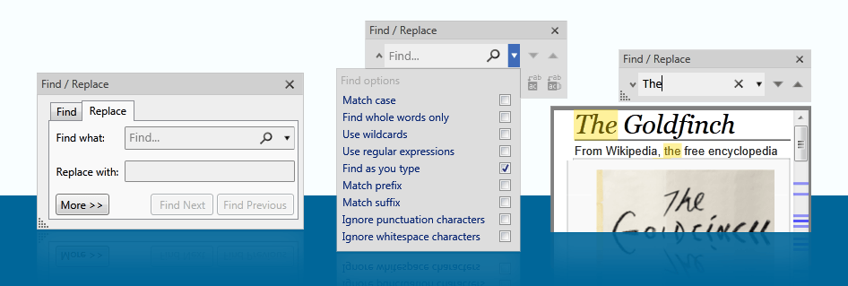

# RapidFindReplaceWPF
A fully featured, rich Find and Replace Control for WPF applications

<h2>Easily add find &amp; replace to your WPF applications.</h2>
<strong>RapidFindReplace WPF</strong> allows developers to quickly add a powerful find &amp; replace dialog tool to WPF apps. Enhance user experience with the ability to
locate &amp; replace strings within textboxes, documents and dozens of controls. RapidFindReplace also features advanced user
options such as Wildcards, Regular Expressions, Case Sensitivity, Whole Word and many more.   You can find more information including <a href="http://keyoti.com/products/rapidfindreplace/wpf/index.html">browsable help and commercial licensing here</a>
 						

<ul class="">

								
<li>'Find only' or 'find and replace' mode</li>
								
<li>Templated</li>

<li>Support for wide range of WPF controls, eg; 

<ul>

<li> TextBox</li>

<li> RichTextBox</li>

<li> ComboBox</li>

<li> DataGrid</li>

<li> Label</li>

<li> ListBox</li>

<li> ListView</li>

<li> TreeView</li>

<li> FlowDocumentPageViewer</li>

<li> FlowDocumentScrollViewer</li>

<li> Button (disabled by default)</li>

<li> IContentHost Controls</li>

<li> Non visual collection of Run objects (ie. strings)</li>

<li> Controls using any of these as child controls (eg. UserControl, Window etc)</li>

</ul>

</li>

								
</ul>
							
							
<ul>
							
<li>Multiple user options similar to those in Office software
								
<ul>

<li>Find as user types (inline highlighting)</li>										

<li>Case matching</li>	

<li>Whole words only</li>											

<li>Wildcards</li>

<li>Regular expressions</li>

<li>Prefix/suffix only matching</li>							

<li>Ignore whitespace</li>

<li>Ignore punctuation</li>

</ul>

</li>							

</ul>

						

					

The controls are templated and may be visually edited in Blend.  The API is open and supports customization and alternative
usages, such as find/replace on Strings or custom containers. 

<h2>About the projects</h2>
<ul>
<li>Keyoti.RapidFindReplaceControl - class library containing the controls, this is the project you would reference</li>
<li>RapidFindReplace_User_Guide - help, and API reference</li>
<li>RapidFindReplace-Demo-CS - C# demo projects, make this the startup project for the solution</li>
<li>RapidFindReplace-Demo-VB - VB.NET demo projects, make this the startup project for the solution if preferred</li>
<li>Tests - unit tests</li>
</ul>